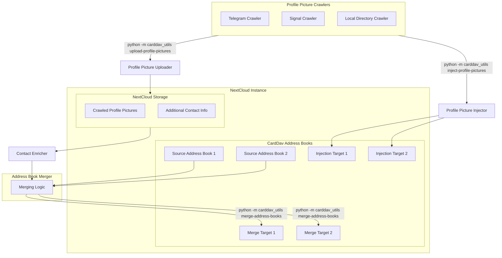

# carddav-utils
Python tooling for my personal CardDav needs.

## Scope & Goal

### Profile Picture Crawling

* Interface for crawling profile pictures from different sources. Currently implemented:
  * Telegram via User Bot API
  * Signal Desktop via [sigtop](https://github.com/tbvdm/sigtop)
  * Local directory with images named after the contact's phone number
* Storing crawled profile pictures on a NextCloud instance
* Inject crawled profile pictures into CardDav address books based on phone numbers

### Address Book Merging

* Merges several CardDav address books into one *without deleting* any existing contacts. Target is to gather all contacts from several address books into one without losing any data that may be deleted in the source address books.
* Tailored for and tested with [NextCloud](https://nextcloud.com) CardDav address books.
* Assumes that UIDs of contacts are unique across all address books.
* Does not consider changes made to contacts in the target address book. Those will be overwritten by the contacts from the source address books on the next sync.
* Support for enriching contacts with crawled profile pictures and additional information (phone numbers, email addresses) before merge. Data is downloaded from NextCloud storage.

## Usage

* Clone the repository
* `pip install .`
* `python -m carddav_utils --help`

## Status and Contributing

This is your usual "let me quickly set up an automation that works for me" project.
It works for me and I don't currently have any plans to extend it.
However, if it's useful for you and you want to contribute, feel free to open an issue or a pull request.

## Diagram

